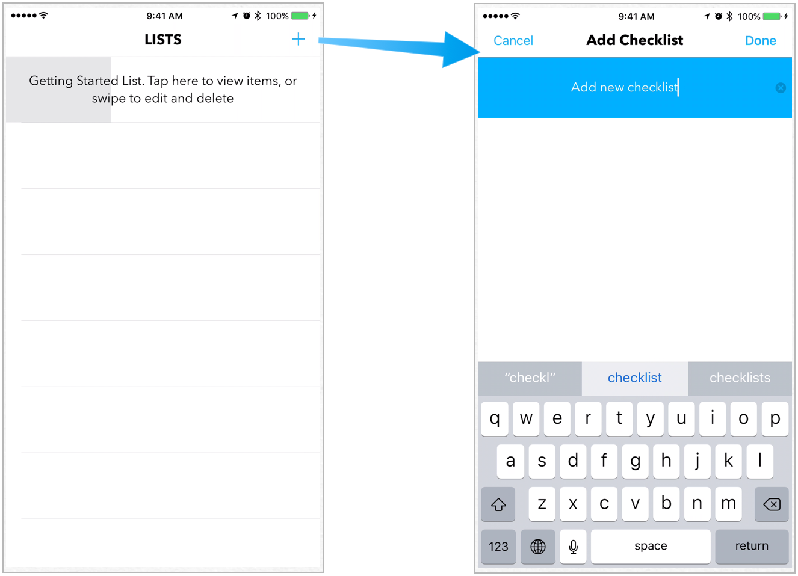
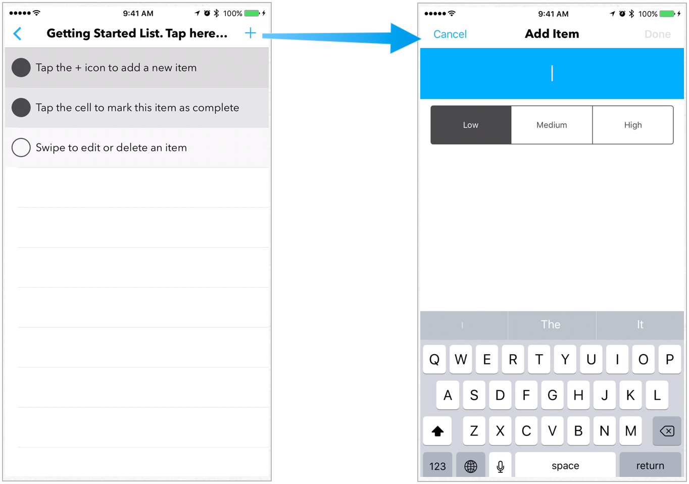
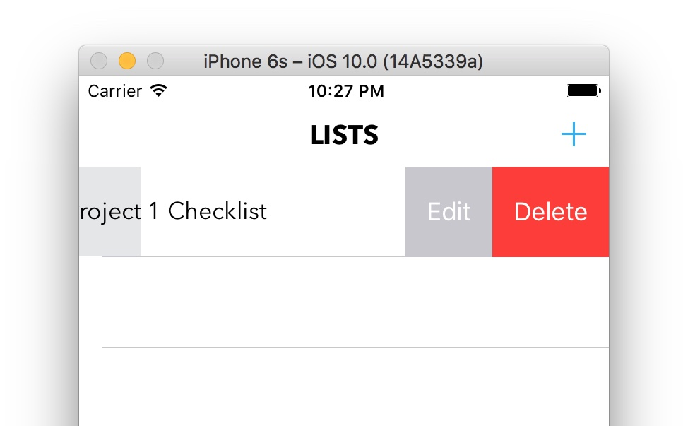
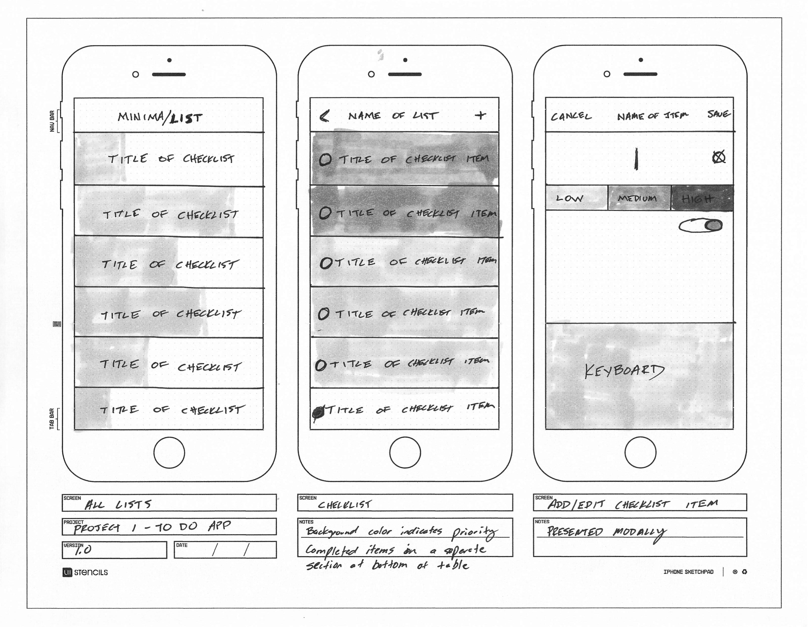
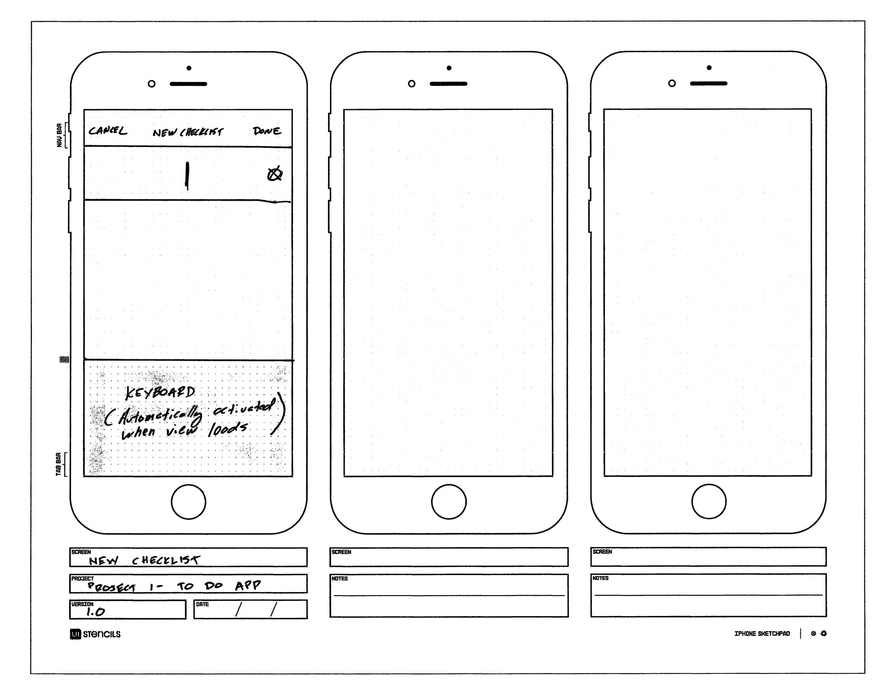

# MinimaList

## Overview

**MinimaList** is a minimalist to-do application, created as Project 1 for my iOS Immersive class at General Assembly. My goal was to design a UI that allows users to quickly view the status of their projects as well as individual tasks. The app is written in Swift 3 using Xcode 8 beta.

## UI

### Demo

Check out [Vimeo](https://vimeo.com/user409534) for a longer demo.

The **All Lists View** shows the user’s current to-do lists in a UITableView. The progress bar in the background of each cell shows the percentage of that list’s tasks that are complete, which gives users a quick way to view the status of multiple projects. Tapping the **+** icon presents the **Add Checklist** screen.

The **Checklist view** displays the individual tasks included in a list. The background color of each cell is used to show the task priority. 

Users can swipe to edit or delete items in both the All Lists view and Checklist view.

## App Icon

The app icon uses the progress bar and typography from the main UI.

## Prototypes

I used a printed PDF template from [UI Stencils](http://www.uistencils.com "UI Stencils website") and markers to create the initial paper prototypes of the app. I later created digital prototypes using [Sketch](https://www.sketchapp.com "Sketch app website").

